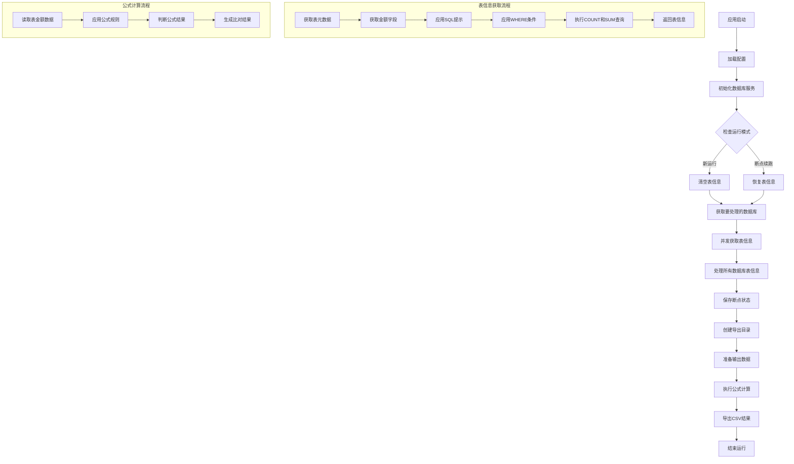

# 数据库校验工具 (DB-Checker)

这个工具用于比对多个数据库中表的金额字段SUM值，支持多数据源配置和各种运行模式。

## 功能特点

- 支持多数据源配置
- 支持断点续跑
- 支持指定表和schema的过滤
- 支持自定义SQL提示和WHERE条件
- 支持多种数据比对公式
- 结果导出为CSV格式

## 项目流程图

## 项目结构

- `DbCheckerApplication.java`: 应用程序入口
- `service/`: 各种服务实现
    - `DatabaseService.java`: 数据库操作核心服务
    - `TableMetadataService.java`: 表元数据服务
    - `FormulaCalculationService.java`: 公式计算服务
- `config/`: 配置相关
    - `DbConfig.java`: 数据库配置
    - `DatabaseInitScriptsProperties.java`: 初始化脚本配置
- `manager/`: 管理器
    - `TableInfoManager.java`: 表信息管理
    - `ResumeStateManager.java`: 断点续跑状态管理
- `model/`: 数据模型
- `util/`: 实用工具
    - `CsvExportUtil.java`: CSV导出工具

## 使用方法

1. 配置`application.properties`中的数据源
2. 配置需要比对的表和规则
3. 运行应用执行比对
4. 查看导出的CSV结果文件 